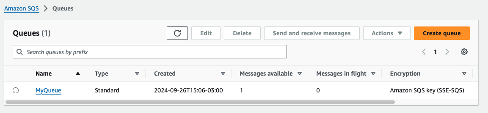

# RAILS - ACTIVE JOB: SQS
As in the [Sidekiq branch](https://github.com/gabrielcostasilva/rails-active-job-getting-started/tree/sidekiq), this project extends the [original](https://github.com/gabrielcostasilva/rails-active-job-getting-started.git) by adding [AWS SQS Adapter](https://github.com/aws/aws-sdk-rails) as a queuing backend for [Active Job](https://guides.rubyonrails.org/active_job_basics.html). A queuing backend is a system that manages the jobs in a queue, processing them in the order they were added. They are recommended in production since Rails Active Job mechanism is based in memory only.

## Project Overview
These are the steps I followed to add the AWS SQS Adapter to the project:
1. Added the [AWS Rails SDK](https://docs.aws.amazon.com/sdk-for-ruby/v3/developer-guide/welcome.html) by running `bundle add aws-sdk-rails`;
2. Ran `bundle install --binstubs` to install the necessary gems and create the binstubs;
3. Ensured you have the [AWS CLI](https://docs.aws.amazon.com/cli/latest/userguide/cli-chap-install.html) installed and configured;
4. Created a new SQS queue by running `aws sqs create-queue --queue-name MyQueue`. This command returns the queue URL, which you are going to need to configure the Rails project;
5. Set SQS as the queuing backend by adding `config.active_job.queue_adapter = :sqs` to the [`config/application.rb`](./config/application.rb) file;
6. Created the [`config/aws_sqs_active_job.yml`](./config/aws_sqs_active_job.yml), and insert the queue URL as:
```yaml
queues:
  default: "https://sqs.<REGION>.amazonaws.com/<YOUR-AWS-ACCOUNT>/MyQueue"
```

## Running the Project
Follow the same steps as in the [original project](https://github.com/gabrielcostasilva/rails-active-job-getting-started.git).

You can check your AWS SQS console to check the messages being enqueued.



Like Sidekiq, you also need a worker to process the jobs. You can run the worker by executing in your terminal: `bundle exec aws_sqs_active_job --queue default`

> A side note: SQS seems a bit limited when compared to Sidekiq. For instance, the documentation highlights _"you cannot schedule jobs for later than 15 minutes in the future"_.

## References

[Introducing new features for the aws-sdk-rails gem](https://aws.amazon.com/blogs/developer/introducing-new-features-for-the-aws-sdk-rails-gem/)
[aws-sdk-rails](https://github.com/aws/aws-sdk-rails)
