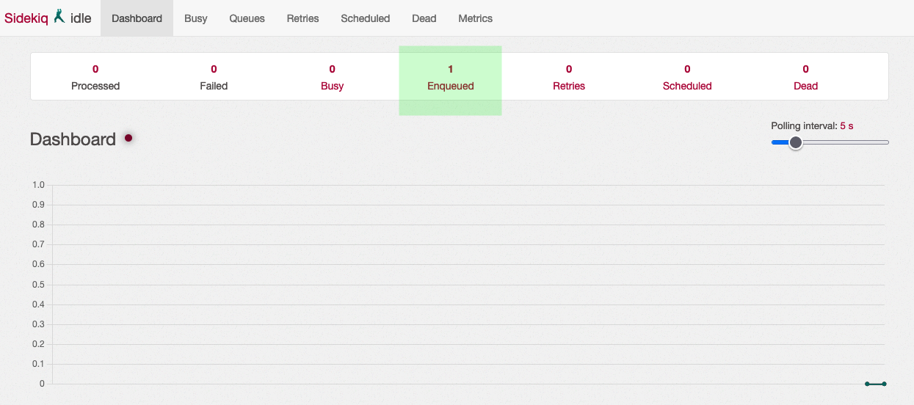
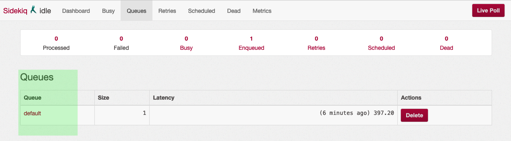
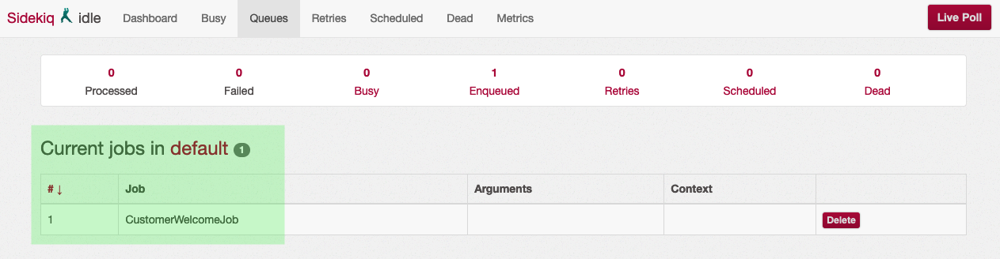
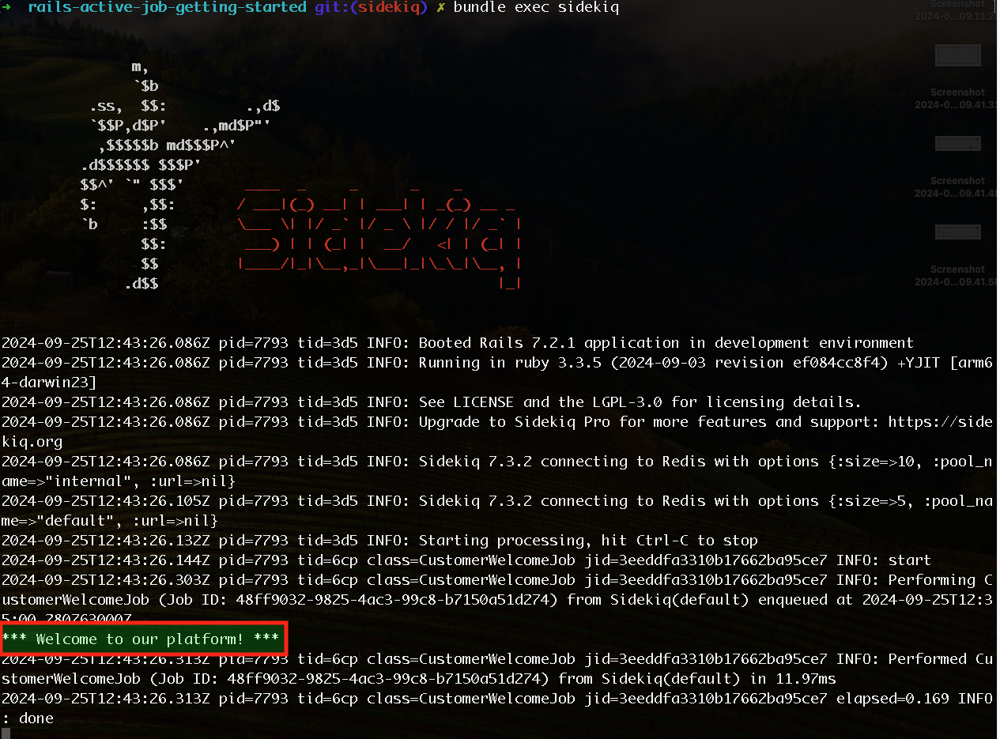
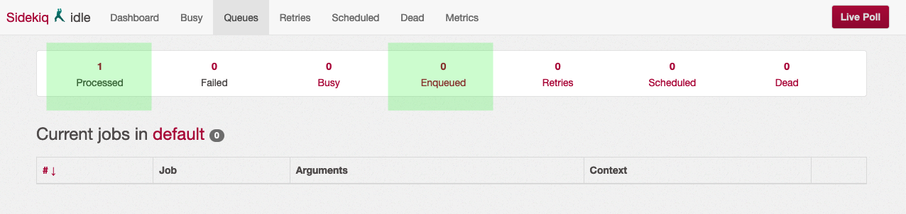

# RAILS - ACTIVE JOB: SIDEKIQ
This project extends the [original](https://github.com/gabrielcostasilva/rails-active-job-getting-started.git) by adding [Sidekiq](https://github.com/sidekiq/sidekiq/wiki/Active-Job) as a queuing backend for [Active Job](https://guides.rubyonrails.org/active_job_basics.html). A queuing backend is a system that manages the jobs in a queue, processing them in the order they were added. They are recommended in production since Rails Active Job mechanism is based in memory only.

## Project Overview
To add Sidekiq to the project, I followed these steps:
1. Ran `bundle add sidekiq` [to add the gem to the project](https://maffan.medium.com/processing-background-jobs-using-sidekiq-gem-in-rails-7-part-i-5c71574ac479);
2. [Configured Sidekiq](https://github.com/gabrielcostasilva/rails-active-job-getting-started/commit/e9f3ccfc25f53e8a203fe81a25331f7dd2689244) to be the default queuing backend by adding `config.active_job.queue_adapter = :sidekiq` to [`config/application.rb`](./config/application.rb);
3. Started a Docker container with Redis, the database Sidekiq uses to store the jobs, by running `docker run -d -p 6379:6379 redis`. Notice you are going to need [Docker installed](https://docs.docker.com/engine/install/) in your machine;
4. Configured the Sidekiq web interface by adding the following lines to [`config/routes.rb`](./config/routes.rb):

```ruby
require 'sidekiq/web'
mount Sidekiq::Web => '/sidekiq'
```

Thus, one can access the Sidekiq web interface at [http://localhost:3000/sidekiq](http://localhost:3000/sidekiq) and monitor the jobs being processed.


## Running the Project
Follow the same steps as in the [original project](https://github.com/gabrielcostasilva/rails-active-job-getting-started.git).

However, notice this time you cannot see the welcome message in your terminal. Checking the [Sidekiq web interface](http://localhost:3000/sidekiq), you can see the jobs are queued to be processed. 



Drilling down into the job details, you can see the queue (_default_) and the job waiting to be processed.



Finally, the job waiting.



However, notice that the jobs are not being processed. To process the jobs, you are going to need to run the Sidekiq server by executing `bundle exec sidekiq` in a separate terminal window. This command starts the Sidekiq server, which is responsible for processing the jobs in the queue.



As result, you can see the queue is empty and a job was processed.


